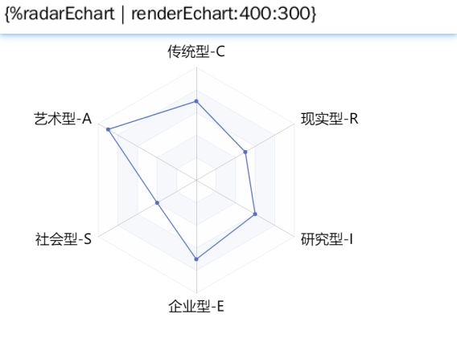

# docxtemplater-cms
docx generator working with templates and data


# 模板语法


## 基础用法

### 普通变量

```
{codeName}
```

​		基础语法支持基本的算术运算符（+、-、*、/）、关系运算符（>、<、>=、<=）、逻辑运算符（&&、||、!）；支持==（类型隐式转换），===（三个等号的类型匹配）；支持布尔值；支持三元运算式；支持数组的 length 等属性，但不支持 indexOf/includes 等方法；

​		**示例：**


### 判断条件

```
{#codeName}内容{/}
```

​		**注意**：满足条件才会显示内容，不满足条件则不会显示内容。

​		**示例：**


### 表格

```
{#codeName}{$index}{col1}{col2}{col3}{/}
```

​		注意：表格中每列的值不需要再加前缀，只需填入每列的字段代码；可以通过 $index 获取数组索引，默认从0开始；

​		**示例：**


### 图片

```
{%codeName}
```

​		**示例：**


### 附件

```
{&codeName}
```

​		**示例：**


## 通用过滤器

### formatDate（日期格式化过滤器）

```
{codeName|formatDate:format}
```

​		**参数：**

| 参数名称 | 参数描述                         | 是否必选 | 默认值 |
| -------- | -------------------------------- | -------- | ------ |
| format   | 日期格式。例如：'YYYY年MM月DD日' | 是       |        |

​		**示例：**


### formatTime（时间格式化过滤器）

```
{codeName|formatTime:format}
```

​		**参数：**

| 参数名称 | 参数描述              | 是否必选 | 默认值 |
| -------- | --------------------- | -------- | ------ |
| format   | 时间格式。例如：'m:h' | 是       |        |

​		**示例：**


### renderEchart（Echart过滤器）

```
{%codeName|renderEchart:width:height}
```

​		基于图片渲染功能实现，支持将echarts图表转换为图片并插入文档的功能，可通过设置可选参数width和height控制生成图片的大小。

​		**参数：**

| 参数名称 | 参数描述                 | 是否必选 | 默认值 |
| -------- | ------------------------ | -------- | ------ |
| width    | 图片宽度，接受数字类型值 | 否       |        |
| height   | 图片高度，接受数字类型值 | 否       |        |

​		**示例：**




### renderHtml（html过滤器）

```
{%codeName|renderHtml:width:height}
```

​		基于图片渲染功能实现，支持将html转换为图片并插入文档的功能，可通过设置可选参数width和height控制生成图片的大小。

​		**参数：**

| 参数名称 | 参数描述                 | 是否必选 | 默认值 |
| -------- | ------------------------ | -------- | ------ |
| width    | 图片宽度，接受数字类型值 | 否       |        |
| height   | 图片高度，接受数字类型值 | 否       |        |


## 表达表单字段专用过滤器

### isSelectedLabel（选中过滤器）

```
{codeName|isSelectedLabel:codeName:define:value:selected:unselected:separator}
```

​		适用于表单中的单选框、复选框、下拉框、级联组件，可根据组件value判断当前选项是否被选中，若选中则显示selected字符，未选中则显示unselected字符。

​		**参数：**

| 参数名称   | 参数描述                           | 是否必选 | 默认值   |
| ---------- | ---------------------------------- | -------- | -------- |
| codeName   | 字段代码。表达表单中对应的字段代码 | 是       |          |
| define     | 表达表单中的define                 | 是       |          |
| value      | 当前选项value值                    | 是       |          |
| selected   | 选中时显示字符                     | 否       | 空字符串 |
| unselected | 未选中时显示字符                   | 否       | 空字符串 |
| separator  | 分隔符。用于多选时多个值的拼接     | 否       | 、       |

​		**示例：**


### getLabel（选择组件label显示过滤器）

```
{codeName|getLabel:codeName:define:separator}
```

​		适用于表单中的单选框、复选框、下拉框、级联组件，当选择组件的value与label不同时，该过滤器可根据value呈现对应的label。

​		**参数：**

| 参数名称  | 参数描述                           | 是否必选 | 默认值 |
| --------- | ---------------------------------- | -------- | ------ |
| codeName  | 字段代码。表达表单中对应的字段代码 | 是       |        |
| define    | 表达表单中的define                 | 是       |        |
| separator | 分隔符                             | 否       | 、     |

​		**示例：**


### getAddress（地址组件过滤器）

```
{codeName|getAddress:separator}
```

​		注意：表达表单的地址组件才能被正确解析。

​		**参数：**

| 参数名称  | 参数描述 | 是否必选 | 默认值 |
| --------- | -------- | -------- | ------ |
| separator | 分隔符   | 否       | /      |

​		**示例：**

